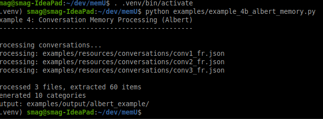
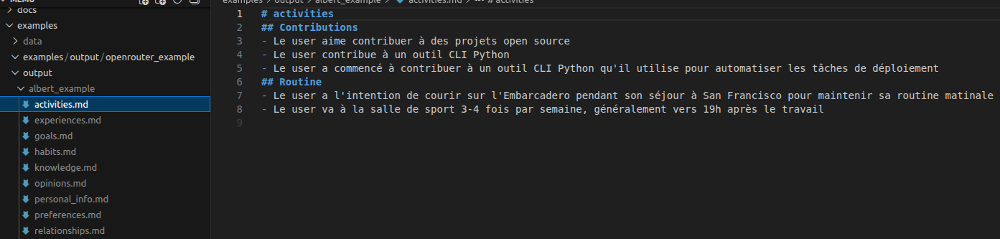

# Utilité de memU

> MemU alimente les agents d'IA autonomes avec une mémoire persistante et évolutive. Prédire continuellement les intentions des utilisateurs, agir de manière proactive et travailler pour vous, même pendant que vous dormez.

**_Ce projet vous intéresse ? Rejoignez l'aventure de notre [expédition de prospection des possibilités de memU](https://chateau-des-robots.notion.site/Memu-3087c008d8b7805fb2f9e14ce0cfa0f2) parmi les nombreuses exepéditions proposées par l'agence d'exploration du Château des Robots._**

Après plusieurs tentatives assez insatisfaisantes (assez instables) avec [MemGPT/Letta](https://github.com/letta-ai/letta-code) pour gérer la mémoire à long terme,
une nouvelle expédition de prospection avec [memU](https://memu.pro/), [memU github](https://github.com/NevaMind-AI/memU)

- difficultés rencontrées avec letta : intégration d'un autre provider difficile

# Différences entre ce dépôt et l'original

- intégration d'[Albert comme provider](./src/memu/llm/backends/albert.py) . Albert provider : https://albert.sites.beta.gouv.fr/ en s'inspirant du modèle basé sur [provider OpenRouter](https://github.com/NevaMind-AI/memU/commit/cba667a56daca5093c9b79a598c7d2ffda813756) . Difficulté rencontrée "Client error '429 Too Many Requests'" -> adapter selon [modèles et limites d'Albert](https://albert.sites.beta.gouv.fr/prices/)
- traduction des conversation en français, adaptation de tous [les prompts](https://github.com/scenaristeur/memU/blob/24cfb2b77d9e3bd02565dcf7b4615b71b6162591/src/memu/prompts/category_patch/category.py#L6)

# Installation

```
git clone https://github.com/scenaristeur/memU.git
cd memU
pyenv install 3.13
memU$ python3.13 -m venv .venv
. .venv/bin/activate
curl https://sh.rustup.rs -sSf | sh
pip install e .
pip install python-dotenv
```

# Utilisation

```
. .venv/bin/activate
(.venv) :~/dev/memU$ python examples/example_4b_albert_memory.py

```

> en cas d'erreur, vous pouvez tenter d'afficher les logs, par exemple en décommantant la ligne `# logging.basicConfig(level=logging.DEBUG, format="%(asctime)s - %(levelname)s - %(message)s")` dans examples/example_4b_albert_memory.py



Résultats dans output :



> A ce stade, nous somme parvenus à produire un exemple d'utilisation de memU avec Albert,

# Troubles

- 429 si on utilise un modèle trop souvent -> bascule de oss à mistral avec un quota plus large, voir aussi pour utiliser les modèles plus petits pour tâches simples, comme le résumé.

Processing conversations...
Processing: examples/resources/conversations/conv1_fr.json
Processing: examples/resources/conversations/conv2_fr.json
Error processing examples/resources/conversations/conv2_fr.json: Client error '429 Too Many Requests' for url 'https://albert.api.etalab.gouv.fr/v1/chat/completions'
For more information check: https://developer.mozilla.org/en-US/docs/Web/HTTP/Status/429
Processing: examples/resources/conversations/conv3_fr.json
Error processing examples/resources/conversations/conv3_fr.json: Client error '429 Too Many Requests' for url 'https://albert.api.etalab.gouv.fr/v1/chat/completions'
For more information check: https://developer.mozilla.org/en-US/docs/Web/HTTP/Status/429

limite 429 : https://stackoverflow.com/questions/22786068/how-to-avoid-http-error-429-too-many-requests-python
